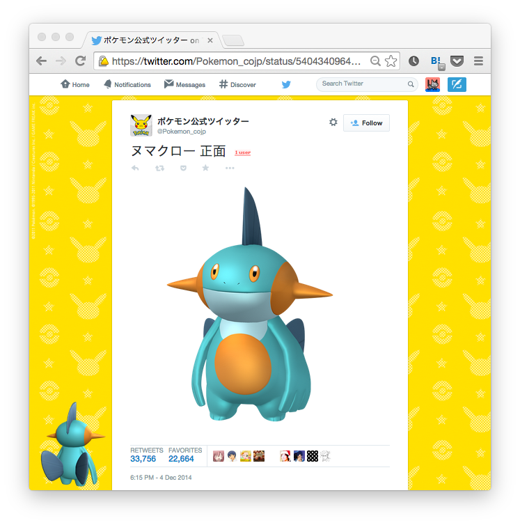

# Numa Chrome

Go! NUMAKURO! What shoud NUMAKURO do?



> **NOTE:** The original image of Numakuro available at [https://twitter.com/Pokemon_cojp/status/540434096455831553](https://twitter.com/Pokemon_cojp/status/540434096455831553).

## How to install

1. Download `numa-chrome.crx` available at [https://github.com/mh61503891/numa-chrome/raw/master/numa-chrome.crx](https://github.com/mh61503891/numa-chrome/raw/master/numa-chrome.crx).
2. Open [chrome://extensions/](chrome://extensions/) on your Chrome.
3. Drag and drop `numa-chrome.crx` to the window.

## How to compile

```bash
$ git clone https://github.com/mh61503891/numa-chrome.git
$ cd numa-chrome
$ gem install crxmake
$ crxmake --pack-extension ./
```
